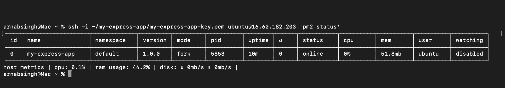
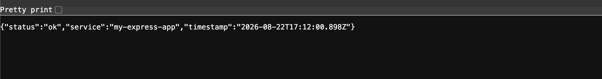
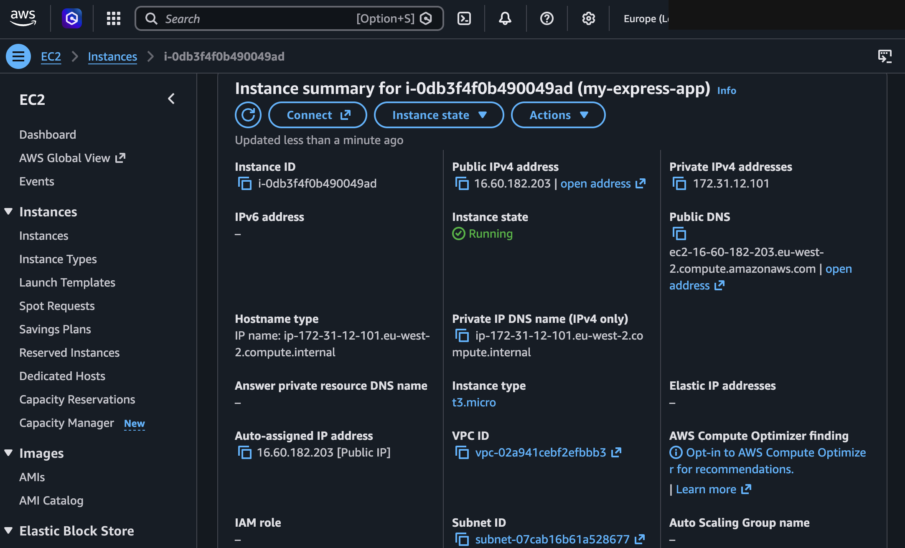
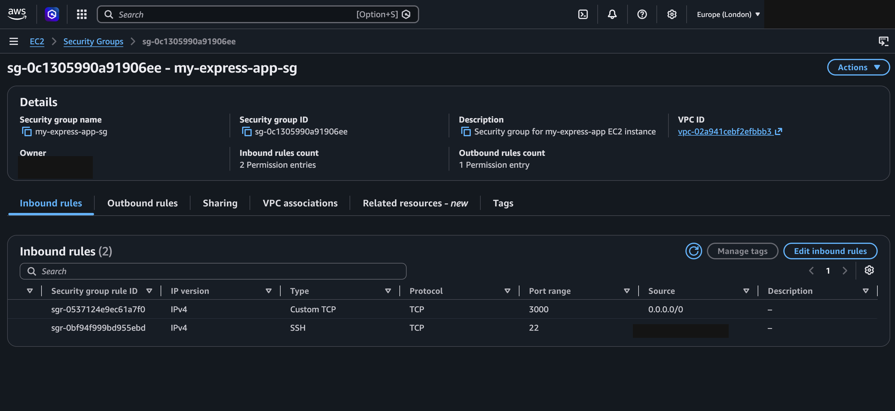

# my-express-app

[](https://github.com/singha105/my-express-app/actions/workflows/ci.yml)
[](LICENSE)

A minimal Express.js app that exposes a single JSON health-check endpoint.

## Tech stack

- [Node.js](https://nodejs.org/) + [Express](https://expressjs.com/) — HTTP server
- [Jest](https://jestjs.io/) + [Supertest](https://github.com/ladjs/supertest) — testing
- [GitHub Actions](.github/workflows/ci.yml) — CI
- [pm2](https://pm2.keymetrics.io/) — process management in production
- AWS EC2 (Ubuntu 22.04) — hosting

## What it does

`GET /` returns a JSON payload with a status flag, service name, and current
timestamp — useful as a starting point for a real service or as a target for
uptime checks.

Example response:

```json
{
  "status": "ok",
  "service": "my-express-app",
  "timestamp": "2026-08-22T12:00:00.000Z"
}
```

## Prerequisites

- [Node.js](https://nodejs.org/) 18 or later
- npm (bundled with Node.js)

## Running locally

```bash
npm install
npm start
```

The server listens on port `3000` by default. Set the `PORT` environment
variable to change it:

```bash
PORT=8080 npm start
```

Then visit `http://localhost:3000/` (or your chosen port) in a browser or
with `curl`.

## Testing

```bash
npm test
```

Runs the [Jest](https://jestjs.io/) suite in `tests/`, which uses
[Supertest](https://github.com/ladjs/supertest) to hit `GET /` and check the
response status and JSON shape. The Express app itself lives in `app.js`
(exported, no listening port) so it can be tested directly without starting
a real server; `index.js` is just the entry point that imports it and calls
`app.listen`. CI runs this same suite on every push and pull request via
[GitHub Actions](.github/workflows/ci.yml).

## Deployment

Deployed to an AWS EC2 instance (Ubuntu 22.04, `t3.micro`, `eu-west-2`),
running under [pm2](https://pm2.keymetrics.io/) so it survives SSH
disconnects.

pm2 is also registered as a systemd service (`pm2-ubuntu.service`), set up
via:

```bash
pm2 startup systemd -u ubuntu --hp /home/ubuntu
pm2 save
```

`pm2 startup` generates and enables a systemd unit that runs `pm2 resurrect`
on boot, restoring whatever process list was last saved with `pm2 save`. So
after any reboot — planned or not — the app comes back up on its own,
without anyone needing to SSH in and restart it. Verified by killing the pm2
daemon and confirming `systemctl start pm2-ubuntu` brought `my-express-app`
back online automatically.

If you deploy a new version of the app later, run `pm2 save` again after
restarting it so the new process list is what gets restored on the next
boot.

## Screenshots

**pm2 confirming the app is running:**



**The app's JSON response, live on the public IP:**



**The EC2 instance in the AWS Console:**



**The security group's inbound rules (SSH restricted to a single IP, app
port open to the world):**



## License

[MIT](LICENSE)
